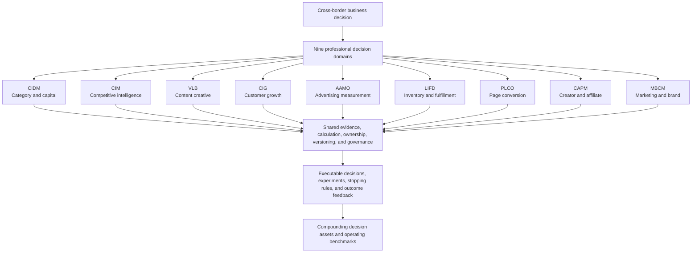
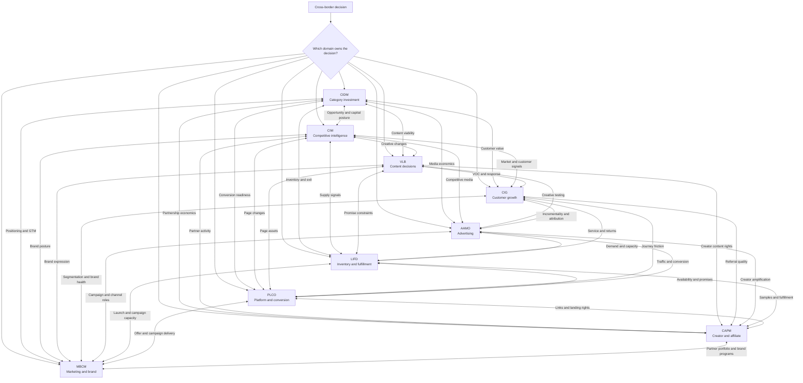

# CrossBorder Decision Lab

[中文首页](README.md) · [Skill Directory](#skill-directory) · [System Architecture](#system-architecture) · [How to Use](#how-to-use)

> Professional decision infrastructure for cross-border commerce—turning experience-dependent judgment into evidence-based, model-backed, actionable, and compounding decision assets.

CrossBorder Decision Lab is built for cross-border operators, brands, investors, and professional teams. It is not a generic prompt collection. It connects category investment, competitive intelligence, content, customers, advertising, fulfillment, conversion, partnerships, and marketing into nine professional domains that can operate independently and collaborate under shared decision contracts.

The current system includes complete core workflows, deterministic and statistical models, evidence and counterevidence rules, multi-turn continuity, single- and cross-Skill execution, pressure scenarios, stopping and exit mechanisms, and repository-wide quality governance.

## System Value and Long-Term Defensibility

Foundation models will continue to improve, and the cost of generating individual answers will continue to decline. The durable value lies above the model: professional decision infrastructure embedded in real operating workflows.

CrossBorder Decision Lab converts fragmented operating experience into reusable system capabilities:

- explicit decision objects, constraints, evidence, counterfactuals, and ownership;
- auditable economics, experiments, action thresholds, and stopping rules;
- coordinated decisions across markets, customers, media, supply, pages, partners, and brands;
- one operating loop for success, failure, incidents, reduction, and exit;
- compounding records of questions, evidence, judgments, actions, outcomes, and corrections.

System value and defensibility are the same flywheel. The more important the decisions, the deeper the system is embedded in workflows, and the more decision assets it accumulates, the more effective—and harder to reproduce—the system becomes.

```text
Professional decision frameworks and models
                    ↓
Embedded cross-border operating workflows
                    ↓
Question–evidence–judgment–action–outcome records
                    ↓
Country, platform, category, and lifecycle benchmarks
                    ↓
Continuously calibrated models, gates, and counterexamples
                    ↓
Higher decision quality and operating certainty
                    ↓
Defensibility through data assets, workflows, governance, and trust
```

Models are replaceable reasoning engines. The durable layer is the accumulated professional method, operating context, calculation tools, shared governance, and decision history.

### Why stronger general-purpose models do not replace it

General-purpose models can interpret materials, generate plans, and support reasoning, but they do not inherently possess a company's accumulated:

1. decision objects and professional ownership boundaries;
2. historical judgments, version changes, and accountability chains;
3. country, platform, category, price-band, and lifecycle benchmarks;
4. success, failure, incident, stopping, and exit cases;
5. continuous links between operating actions and subsequent results;
6. shared evidence, calculation, and approval language across teams.

Models are upgradeable and replaceable reasoning engines. CrossBorder Decision Lab preserves the professional methods, operating context, calculation tools, collaboration protocols, and compounding decision assets above them.

### The compounding mechanism of long-term use

Every real use increases the system's long-term value:

- new questions expand professional scenario coverage;
- new evidence enriches country, platform, and category benchmarks;
- new actions extend operating strategies and execution boundaries;
- new outcomes recalibrate parameters, gates, and counterfactuals;
- new failures become counterexamples, pressure tests, and blocking conditions;
- new collaboration becomes traceable and reusable organizational workflow.

This moves the system from “answering professional questions” toward “continuously managing professional decisions.”

## System Architecture

### Three-layer value architecture



### Nine-Skill collaboration map



Connections exchange versioned evidence and constraints; they do not transfer final decision ownership.

## Skill Directory

Choose the primary Skill by the decision that must be made. Platform coverage, professional models, workflows, inputs, outputs, and failure boundaries live inside each Skill.

| Skill | Runtime | Decision owned | Entry |
|---|---|---|---|
| CIDM | `CIDM-2026.14` | Enter, invest, test, scale, reduce, or exit | [Category Investment](category-investment-decision/SKILL.md) |
| CIM | `CIM-2026.10` | Identify competitors, detect change, interpret impact, and respond | [Competitive Intelligence](competitive-intelligence-monitoring/SKILL.md) |
| VLB | `VLB-2026.10` | Explain, adapt, produce, test, and scale content mechanisms | [Content Creative](video-link-breakdown/SKILL.md) |
| CIG | `CIG-2026.09` | Understand customers, friction, incremental value, and growth | [Customer Growth](consumer-insights-customer-growth/SKILL.md) |
| AAMO | `AAMO-2026.08` | Diagnose, measure, budget, scale, or stop advertising | [Advertising](advertising-analysis-measurement-optimization/SKILL.md) |
| LIFD | `LIFD-2026.04` | Route, replenish, allocate, fulfill, recover, or exit | [Logistics and Inventory](logistics-inventory-fulfillment-decision/SKILL.md) |
| PLCO | `PLCO-2026.08` | Diagnose and improve stores, listings, pages, and funnels | [Platform and Conversion](platform-store-listing-conversion/SKILL.md) |
| CAPM | `CAPM-2026.07` | Select, price, contract, operate, renew, or exit partners | [Creator and Affiliate](creator-affiliate-partnership-management/SKILL.md) |
| MBCM | `MBCM-2026.01` | Segment, position, launch, build brands, and orchestrate campaigns | [Marketing and Brand](marketing-brand-campaign-management/SKILL.md) |

Detailed platform coverage, models, workflows, inputs, outputs, and failure boundaries live inside each Skill.

## Shared Decision Infrastructure

The nine domains share:

1. evidence and counterevidence discipline;
2. auditable economics and statistical estimation;
3. explicit professional ownership;
4. object, evidence, calculation, conclusion, and action lineage;
5. multi-turn selective recomputation;
6. actions with success, stopping, rollback, and exit rules;
7. missing-data, conflict, incident, and pressure handling;
8. long-term calibration by country, platform, category, and lifecycle.

## Current Capabilities

The current version provides nine professional decision Skills that can operate independently and collaborate across domains. It includes:

- professional scenario and lifecycle coverage;
- deterministic economics and statistical estimation tools;
- single-Skill, cross-Skill, and multi-turn execution;
- extreme combinations, conflicts, missing inputs, failures, and pressure tests;
- evidence, calculation, conclusion, action, and version lineage;
- professional ownership, risk redlines, stopping, rollback, and exit governance;
- repository-wide automated validation and release gates.

The system is not tied to a single foundation-model provider. Models can continue to improve while professional decision contracts, calculation tools, operating benchmarks, and historical assets remain continuous.

## How to Use

### 1. Describe the decision in natural language

Examples:

- “Should we enter this category on Amazon US?”
- “Why did this competitor suddenly start growing?”
- “Why does this video work, and does the mechanism fit our product?”
- “Why did this customer cohort fail to repurchase?”
- “Our ads generate orders but no profit—what should we do?”
- “How much should we replenish, and which warehouse should we use?”
- “How should we rewrite this Listing and rebuild its image set?”
- “Is this creator worth sampling and contracting?”
- “How should we position, launch, and market this new product?”

### 2. Let the primary Skill make the professional judgment

The owning Skill fixes the decision object, evidence, constraints, and objective; runs the relevant models; and returns actions, success conditions, stopping rules, and any required handoffs.

### 3. Add cross-Skill collaboration when needed

Complex decisions can exchange versioned evidence and constraints across domains, while the Skill that owns the decision retains the final conclusion.

### 4. Feed outcomes back into the system

Operating actions and results update benchmarks, parameters, counterexamples, and the next decision cycle.

## Repository Navigation

| Location | Purpose |
|---|---|
| Nine Skill directories | Professional workflows, models, references, and tests |
| [`evaluations/`](evaluations/) | Single-Skill, cross-Skill, multi-turn, adversarial, and extreme scenarios |
| [`governance/`](governance/) | Ownership, maturity, change-impact, and shared contracts |
| [`scripts/`](scripts/) | Repository validation, scoring, integration, and release gates |
| [`.github/workflows/expert-release.yml`](.github/workflows/expert-release.yml) | Automated release-quality gate |
| [`requirements-dev.txt`](requirements-dev.txt) | Locked dependencies for local and automated validation |
| [`RULES.md`](RULES.md) | Maintenance, versioning, testing, and release rules |
| [`README.md`](README.md) | Chinese project homepage |

## Quality and Safety

- Current platform rules, regulations, prices, and market facts are checked at execution time.
- Platform attribution, correlation, prediction, and causal incrementality remain distinct.
- Financial conclusions separate facts, user inputs, benchmarks, and scenarios.
- Legal, tax, intellectual-property, and regulatory matters retain qualified ownership.
- The system does not support deceptive claims, fake engagement, infringement, review manipulation, or platform evasion.
- Content transfer focuses on reusable mechanisms and test logic rather than copying protected expression.

## Copyright

Copyright © 2026 Miles Chen. All rights reserved.

CrossBorder Decision Lab and its original decision frameworks, scoring models, workflows, documentation, and code are protected by copyright. They may not be copied, modified, distributed, sublicensed, sold, commercially used, or used to create derivative works without prior written permission from the copyright owner. See [LICENSE](LICENSE).
