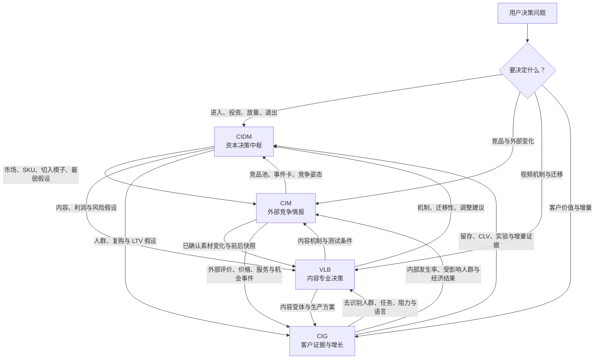

# CrossBorder Decision Lab

An evidence-driven decision capability for cross-border commerce. It helps operators, sellers, investors, and content teams answer four practical questions:

1. What is worth selling?
2. Is the opportunity commercially viable and controllable?
3. How should it be validated before committing meaningful capital?
4. When should the business scale, iterate, hold, or stop?

The repository contains four independent but interoperable Codex skills:

```text
CrossBorder Decision Lab
├── CIDM — Category Investment Decision
│   └── category, SKU, market-entry, portfolio, and lifecycle decisions
├── VLB — Video Link Breakdown
│   └── content mechanism, commerce viability, localization, and scale decisions
├── CIM — Competitive Intelligence Monitoring
│   └── competitor profiles, snapshots, anomaly attribution, alerts, and signal routing
└── CIG — Consumer Insights & Customer Growth
    └── customer evidence, lifecycle, CLV, experiments, uplift, and next-best actions
```

This is not a generic research prompt library. It is a structured analysis system with evidence grading, explicit assumptions, decision gates, quantitative models, confidence controls, redline overrides, validation plans, and stopping rules.

## Quick Skill Routing / Skill 快速定位

按“要做什么决策”选择主 Skill，而不是按手头文件格式选择。四个 Skill 都能独立运行；跨 Skill 承接只在用户明确要求或提供上游报告时发生，不静默覆盖历史结论。

| 主 Skill | 核心问题 | 主要交付 | 什么时候向下承接 |
|---|---|---|---|
| **CIDM — 品类投资决策** | 是否进入、投资、测试、放量、缩减或停止？ | 投资结论、门槛、评分、利润、验证和资本动作 | 需要持续竞争证据、内容可行性验证或一方客户验证时 |
| **CIM — 竞品情报与持续监控** | 竞品是谁、发生了什么变化、为什么重要？ | 商品识别、竞品池、分层、基线、事件卡、竞争姿态和告警 | 信号可能改变投决、需要拆解视频机制或验证我方客户是否同样受影响时 |
| **VLB — 视频内容与商业决策** | 视频为何有效、能否迁移、是否值得测试或规模化？ | 内容机制、迁移性、商业约束、测试变体和停止条件 | 结果可能改变投决、需要竞争时间线或需要客户增量实验时 |
| **CIG — 消费者洞察与客户增长** | 客户是谁、什么是真增量、采取什么动作更有价值？ | 客户证据、生命周期、CLV、实验/Uplift 和下一最佳动作 | 客户证据可能改变投决、解释竞品信号或指导内容测试时 |



### 承接规则

1. **CIDM 负责资本决策。** CIM、VLB、CIG 提供专业证据或调整建议；任何单项专业评分都不等于最终投资结论。
2. **CIM 负责外部变化。** 先确认竞品身份、快照、事件和竞争影响，再把信号路由到下游。
3. **VLB 负责内容机制。** 内容高分不证明销量、份额、留存或利润。
4. **CIG 负责一方客户证据与增量有效性。** 预测不等于因果，只有可信实验或准实验才能声称增量影响。
5. **所有承接都必须显式、可逆。** 保留 Skill/模型版本、证据或事件 ID、数据截止日、原结论、建议调整、置信度和门槛影响，不静默改写历史报告。

### 常用完整链路

| 场景 | 推荐链路 | 最终由谁决断 |
|---|---|---|
| 新品类或新商品 | `CIDM → CIM → 按需 VLB/CIG → CIDM` | CIDM 重判进入和验证 |
| 竞品或素材异动 | `CIM → VLB → CIM → 必要时 CIDM` | CIM 管事件；CIDM 管资本影响 |
| 客户痛点或流失 | `CIG → 按需 CIDM/CIM/VLB → CIG` | CIG 验证客户影响与增量 |
| 内容商业化 | `CIDM/CIG 提供上下文 → VLB → CIG 实验 → CIDM` | CIG 验证增量；CIDM 决定投资 |
| 上市后监控 | `CIM + CIG → CIDM；内容事件再接 VLB` | CIDM 决定放量、维持、复核、缩减或停止 |

## What makes the analysis decision-grade

- **Evidence before conclusion:** observations, measured data, user inputs, external benchmarks, and inferences are separated instead of blended into one narrative.
- **Commercial gates before scoring:** an attractive score cannot override negative contribution margin, serious compliance exposure, an inaccessible market, or the absence of a credible winning wedge.
- **Auditable economics:** unit economics, reverse funnels, portfolio break-even, and experiment evaluation are calculated with deterministic scripts rather than hidden arithmetic.
- **Confidence-aware outputs:** missing or weak evidence lowers confidence and may downgrade the decision; uncertainty is not converted into false precision.
- **Actionable decisions:** outputs end with a decision, the reasons behind it, the weakest assumption, required actions, validation metrics, budget boundaries, and stop conditions.
- **Lifecycle coverage:** the system supports opportunity screening, diligence, launch validation, scaling, steady-state monitoring, decline diagnosis, and exit review.
- **Non-destructive integration:** VLB may propose evidence-based adjustments to CIDM, but never silently rewrites a historical investment conclusion.

## CIDM — Category Investment Decision

**Path:** `category-investment-decision/`

**Runtime:** `CIDM-2026.09`

CIDM evaluates whether a category, product, SKU, market, or portfolio deserves investment. It supports Amazon, TikTok Shop, Shopee, Lazada, Shopify/DTC, Walmart, eBay, Etsy, Temu, Shein, and other cross-border channels through platform- and country-specific routing.

### Decisions supported

- category and product opportunity screening;
- product-link or ASIN reverse analysis;
- competitor structure, VOC, pain-point, and market-gap analysis;
- keyword opportunity and traffic-entry strategy;
- country, region, platform, and channel-entry comparison;
- multi-candidate ranking and budget-constrained portfolio selection;
- unit economics, contribution margin, break-even advertising, and sensitivity analysis;
- small-budget test design and Go / Iterate / Stop review;
- store replenishment, SKU extension, and existing-product diagnosis;
- post-launch scaling, steady-state control, decline diagnosis, exit, and failure review;
- competitor monitoring and evidence feedback into future decisions.

### Decision architecture

CIDM first applies five pre-check gates:

| Gate | Core question |
|---|---|
| Market sufficiency | Is demand large and stable enough to support the target outcome? |
| Entry feasibility | Can a new or non-leading offer obtain traffic and overcome the incumbent moat? |
| Profitability | Does the opportunity remain profitable after the complete cost stack? |
| Sellability and compliance | Can it be sourced, shipped, listed, advertised, and sold within acceptable risk? |
| Winning wedge | Is there a specific, executable reason for customers to choose this offer? |

Opportunities that pass the gates are evaluated across seven weighted dimensions: market demand, competitive entry, profit, content propagation, supply-chain control, risk control, and opportunity window. Every score is paired with evidence strength and confidence; redlines override the total score.

### Delivery levels

| Level | Best for | Typical output |
|---|---|---|
| Decision Card | Rapid screening or an early comparison | decision, key evidence, redlines, missing inputs, next action |
| Decision Memo | A normal category or SKU investment decision | gate results, scoring, economics, risks, test plan, stop rules |
| Investment Diligence | High-budget, multi-market, or portfolio decisions | full evidence ledger, scenarios, sensitivities, portfolio logic, staged capital plan |

### Deterministic models

- `profit_model.py`: unit economics, contribution margin, advertising limits, and batch break-even;
- `reverse_funnel.py`: required orders, clicks, impressions, and creator-level funnel targets;
- `portfolio_break_even.py`: minimum portfolio success rate and expected profit;
- `portfolio_selector.py`: constrained SKU selection under budget and capacity limits;
- `analyze_voc.py`: reproducible aggregation of coded VOC evidence;
- `evaluate_experiment.py`: preregistered launch-gate evaluation;
- `workspace_manager.py`: safe temporary workspace creation and cleanup.

## VLB — Video Link Breakdown

**Path:** `video-link-breakdown/`

**Runtime:** `VLB-2026.08`

VLB turns a video link or supplied media artifact into a content and commerce decision. It evaluates not only why a video may hold attention, but whether its mechanism fits the target product, audience, platform, market, economics, compliance constraints, and production system.

### Decisions supported

- single-video teardown and second-level rhythm mapping;
- hook, narrative, script, editing, sound, visual-focus, and CTA analysis;
- multi-video competitive comparison and account diagnosis;
- audience, consumption-scenario, and platform-fit inference;
- script rewriting, shot-list design, and structured A/B hypotheses;
- product-video fit and commerce-funnel diagnosis;
- unit economics, allowable CPA, ROI, and net-margin scenarios;
- country-level language, actor, setting, price, claim, and compliance localization;
- creator portfolio, batch-production system, material fatigue, and refresh strategy;
- structured VLB-to-CIDM evidence adjustment when explicitly requested.

### Evidence protocol

VLB labels the basis of material conclusions so that visible facts are not confused with estimates:

| Label | Meaning |
|---|---|
| `O` | Direct observation from the video or supplied artifact |
| `M` | Measured metadata, account data, or platform data |
| `U` | User-provided business input |
| `B` | External benchmark with source and date |
| `I` | Inference derived from the available evidence |

If only metadata or keyframes are available, VLB produces a limited analysis and states what evidence is required for a full teardown. It does not invent dialogue, retention curves, conversion rates, audience composition, or algorithmic conclusions.

### Analysis modules

| Module | Coverage |
|---|---|
| Standard teardown | rhythm, emotion, script, audiovisual language, audience, platform fit, replication |
| Goal-specific scoring | normalized weights selected for content, commerce, or competitive objectives |
| Commerce decision | commercial gates, product-video fit, funnel, economics, ROI, and stop conditions |
| Localization and compliance | market-specific adaptation and commercial compliance quick-screen |
| Creator scale system | creator allocation, material matrix, production economics, fatigue testing |
| CIDM integration | structured and reversible adjustment proposal with evidence IDs |

## How CIDM and VLB work together

The skills remain usable independently. Integration occurs only when the user explicitly requests it or provides a relevant prior report.

```text
CIDM investment hypothesis
        ↓
content propagation, wedge, profit, and risk assumptions
        ↓
VLB validates the content mechanism and commerce feasibility
        ↓
structured adjustment proposal with evidence and confidence
        ↓
user accepts, rejects, or tests the proposed change
```

VLB can challenge CIDM assumptions about product-video fit, creator cost, conversion economics, claim risk, and replicability. Historical reports and scores are never overwritten automatically.

## CIM — Competitive Intelligence Monitoring

**Path:** `competitive-intelligence-monitoring/`

**Runtime:** `CIM-2026.09`

CIM identifies a user's product from a description, link, ASIN/SKU, store, image, or screenshot; discovers and tiers competitors on a specified platform and market; and continues into external intelligence monitoring when requested. It covers entity/product/snapshot/event records, price and listing changes, reputation, assortment, creative, advertising and channel signals, dynamic baselines, anomaly attribution, CPI/positioning, competitive posture, alerts, and professional Markdown reports. It can route confirmed signals to CIDM, VLB, CIG, listing, pricing, advertising, inventory, supply-chain, or operating-diagnosis capabilities. It does not silently change downstream reports or execute operating actions.

Deterministic helpers include `compare_snapshots.py`, `detect_changes.py`, and `build_monitoring_report.py`; they identify changed fields and threshold events but never invent causal attribution.

## CIG — Consumer Insights & Customer Growth

**Path:** `consumer-insights-customer-growth/`

**Runtime:** `CIG-2026.08`

CIG converts authorized first-party customer events, transactions, usage, service, feedback, returns, surveys, and contact logs into auditable consumer insights and incremental growth decisions. It covers identity/event/consent rules, data quality, VOC evidence, RFM and lifecycle, cohort retention, contribution-profit CLV, repurchase/churn/timing, experiments, uplift, next-best actions, contact constraints, and model governance. Prediction is never presented as causal effect, “do not contact” is a formal action, and the Skill does not execute CRM or advertising changes.

Its deterministic helpers validate events, build rule-based RFM segments, calculate cohort retention and scenario CLV, evaluate binary experiments, rank user-supplied uplift actions under constraints, and render reviewable growth cards.

## Quality and safety boundaries

- Current market facts, regulations, platform rules, prices, and competitive conditions require dated external verification.
- Compliance, tax, intellectual-property, and product-safety outputs are commercial screening, not a substitute for qualified legal or regulatory review.
- Financial conclusions distinguish user inputs, sourced benchmarks, and assumptions; scenario output does not guarantee results.
- The system does not recommend fake engagement, deceptive claims, undisclosed advertising, infringement, review manipulation, or platform-rule evasion.
- Replication focuses on transferable structure and testing logic rather than copying protected scripts, footage, or distinctive creative expression.

## Repository structure and validation

| Path | Purpose |
|---|---|
| `category-investment-decision/` | CIDM skill, decision references, financial models, and tests |
| `video-link-breakdown/` | VLB skill, modular analysis references, video preparation, and tests |
| `competitive-intelligence-monitoring/` | CIM skill, competitor schemas, monitoring protocols, anomaly detection, reports, and tests |
| `consumer-insights-customer-growth/` | CIG skill, customer evidence, lifecycle, CLV, experiments, uplift, governance, and tests |
| `scripts/validate_repo.py` | repository-wide runtime, link, metadata, and scoring validation |
| `scripts/test_cross_skill_integration.py` | CIDM, VLB, CIM, and CIG cross-skill integration tests |
| `RULES.md` | maintenance, versioning, workspace, validation, and Git conventions |
| `LICENSE` | copyright and usage restrictions |

Validation covers both Codex skill structure and repository-specific invariants. The current regression suites cover finance, reverse funnels, portfolio decisions, VOC aggregation, experiments, workspace safety, and video-preparation input handling.

See [RULES.md](RULES.md) for repository conventions.

---

# 出海决策实验室

一套面向跨境商业的证据驱动专业决策能力，帮助运营者、卖家、投资决策者与内容团队回答四个核心问题：

1. 什么值得卖？
2. 这个机会是否能进入、能盈利、风险是否可控？
3. 在投入重要资金之前，应该怎样验证？
4. 什么时候应该放量、迭代、维持或停止？

仓库包含四项相互独立、又可以按需协同的 Codex 专业能力：

```text
出海决策实验室
├── CIDM — 品类投资决策
│   └── 品类、SKU、市场进入、投资组合与生命周期决策
├── VLB — 视频内容与商业决策
│   └── 内容机制、商业可行性、本地化与规模化决策
├── CIM — 竞品情报与持续监控
│   └── 竞品画像、快照、异动归因、预警与信号路由
└── CIG — 消费者洞察与客户增长
    └── 客户证据、生命周期、CLV、实验、Uplift 与下一最佳动作
```

它不是一组泛化的研究提示词，而是一套包含证据分级、显式假设、前置门槛、量化模型、置信度控制、红线否决、验证计划和停止条件的结构化分析系统。

## 为什么具备专业决策价值

- **先证据，后结论：** 将直接观察、实测数据、用户输入、外部基准与分析推断分开，避免把推测包装成事实。
- **先过商业门槛，再进行评分：** 高分不能覆盖负贡献利润、重大合规风险、无法进入的市场或不存在有效切入点等问题。
- **经济模型可审计：** 单位经济、反推漏斗、组合盈亏平衡和实验复盘由确定性脚本计算，不依赖不可追溯的心算。
- **结果受置信度约束：** 证据缺失或质量不足会降低置信度并触发降级，不用伪精确数字填补空白。
- **交付可以直接行动：** 最终输出必须包含结论、理由、最弱假设、下一步动作、验证指标、预算边界和停止条件。
- **覆盖完整经营周期：** 从机会初筛、尽调、测款和放量，延伸到稳态监控、衰退诊断与退出复盘。
- **跨能力协同但不破坏历史结论：** VLB 可以提出对 CIDM 的证据调整建议，但不会静默修改历史投决报告。

## CIDM — 品类投资决策

**目录：** `category-investment-decision/`

**运行模型：** `CIDM-2026.09`

CIDM 用于判断一个品类、产品、SKU、国家市场或候选组合是否值得投入。针对 Amazon、TikTok Shop、Shopee、Lazada、Shopify/DTC、Walmart、eBay、Etsy、Temu、Shein 等跨境渠道，按平台流量逻辑和目标国家进行差异化路由。

### 支持的决策场景

- 品类与产品机会初筛；
- 商品链接或 ASIN 反向分析；
- 竞品结构、VOC、用户痛点与市场空白分析；
- 关键词机会与流量切入策略；
- 国家、区域、平台与渠道进入比较；
- 多候选横向排名及预算约束下的投资组合选择；
- 单位经济、贡献利润、广告盈亏平衡与敏感性分析；
- 小预算测款设计及 Go / Iterate / Stop 复盘；
- 店铺补品、老品扩展与存量商品诊断；
- 上市后放量、稳态控制、衰退诊断、退出和失败复盘；
- 竞品持续监控与新证据回写。

### 决策架构

CIDM 首先执行五道前置门槛：

| 门槛 | 核心问题 |
|---|---|
| 市场是否足够 | 需求规模与稳定性是否能够支撑目标结果？ |
| 是否能够进入 | 新卖家或非头部产品能否获得流量并突破现有壁垒？ |
| 是否能够赚钱 | 纳入完整成本后，机会是否仍然具备可接受利润？ |
| 是否能够安全销售 | 采购、运输、上架、宣传和销售风险是否可控？ |
| 为什么用户选择我们 | 是否存在具体、可执行、可验证的获胜切入点？ |

通过门槛的机会再进入七维加权评分：市场需求、竞争进入、利润空间、内容传播、供应链控制、风险控制与机会窗口。每个评分都要绑定证据强度和置信度；红线风险可以直接覆盖总分。

### 交付等级

| 等级 | 适用情况 | 典型交付 |
|---|---|---|
| Decision Card | 快速初筛或早期比较 | 结论、关键证据、红线、缺失信息、下一步动作 |
| Decision Memo | 常规品类或 SKU 投资决策 | 门槛、评分、利润、风险、测款计划、停止条件 |
| Investment Diligence | 高预算、多市场或组合投资 | 完整证据账本、情景与敏感性、组合逻辑、分阶段资金计划 |

### 确定性计算模型

- `profit_model.py`：单位经济、贡献利润、广告承受上限与批量盈亏平衡；
- `reverse_funnel.py`：目标订单、点击、曝光与达人层级漏斗反推；
- `portfolio_break_even.py`：组合最低成功率与期望利润；
- `portfolio_selector.py`：预算与执行能力约束下的 SKU 组合选择；
- `analyze_voc.py`：已编码 VOC 证据的可重复聚合；
- `evaluate_experiment.py`：预注册测款门槛复盘；
- `workspace_manager.py`：临时工作区的安全创建与清理。

## VLB — 视频内容与商业决策

**目录：** `video-link-breakdown/`

**运行模型：** `VLB-2026.08`

VLB 将视频链接或用户提供的媒体素材转化为内容与商业决策。它不仅分析视频为什么可能获得注意力，还会判断其内容机制是否适合目标产品、目标用户、目标平台和国家，是否满足利润及合规要求，以及能否被稳定复制和规模化生产。

### 支持的决策场景

- 单视频深度拆解与秒级节奏图谱；
- 钩子、叙事、脚本、剪辑、声音、视觉焦点与 CTA 分析；
- 多视频竞品比较与账号诊断；
- 受众、消费场景与平台适配推断；
- 脚本改写、分镜设计与结构化 A/B 假设；
- 产品—视频匹配度与电商转化漏斗诊断；
- 单位经济、可承受 CPA、ROI 与净利润率情景；
- 语言、演员、场景、价格、宣称与合规的国家级本地化；
- 达人组合、批量生产、素材疲劳与更新策略；
- 用户明确要求时，向 CIDM 输出结构化证据调整建议。

### 证据协议

VLB 为重要结论标记证据来源，避免把可见事实与估算混在一起：

| 标记 | 含义 |
|---|---|
| `O` | 从视频或用户素材中直接观察到的事实 |
| `M` | 元数据、账号后台或平台实测数据 |
| `U` | 用户提供的业务输入 |
| `B` | 带来源和日期的外部基准 |
| `I` | 基于现有证据形成的分析推断 |

如果只能取得元数据或关键帧，VLB 会降级为有限分析，并明确完成完整拆解还需要哪些证据；不会虚构对白、留存曲线、转化率、受众结构或平台算法结论。

### 分析模块

| 模块 | 覆盖范围 |
|---|---|
| 标准内容拆解 | 节奏、情绪、脚本、视听语言、受众、平台适配与复刻边界 |
| 目标化评分 | 根据内容、商业或竞品目标选择归一化权重 |
| 商业决策 | 商业门槛、产品—视频匹配、漏斗、利润、ROI 与停止条件 |
| 本地化与合规 | 目标市场适配和商业合规快筛 |
| 达人与素材规模系统 | 达人分配、素材矩阵、生产经济、疲劳测试 |
| CIDM 对接 | 带证据编号、可接受或拒绝的结构化调整建议 |

## CIDM 与 VLB 如何协同

两项能力可以独立运行。只有用户明确提出对接，或提供相关历史报告时，才启动协同流程。

```text
CIDM 投资假设
      ↓
内容传播、获胜切入点、利润与风险假设
      ↓
VLB 验证内容机制与商业可行性
      ↓
输出带证据和置信度的结构化调整建议
      ↓
由用户决定接受、拒绝或进入下一轮测试
```

VLB 可以挑战 CIDM 对产品—视频匹配、达人成本、转化经济、内容宣称风险和规模复制能力的判断，但不会自动覆盖历史报告和历史评分。

## CIM — 竞品情报与持续监控

**目录：** `competitive-intelligence-monitoring/`

**运行时：** `CIM-2026.09`

CIM 支持从一句描述、商品链接、ASIN/SKU、店铺、图片或截图识别自有商品，在指定平台和国家发现、筛选并进行 T1–T4 竞品分层，也可以在用户要求后继续建立外部监控。它覆盖主体/商品/快照/事件数据、价格、Listing、口碑、商品矩阵、内容、广告与渠道信号、动态基线、异动归因、CPI/定位、竞争姿态、告警和专业 Markdown 报告。它可以向 CIDM、VLB、CIG、Listing、定价、广告、库存、供应链和经营诊断路由已确认信号，不静默改写下游报告，不自动执行经营动作。

## CIG — 消费者洞察与客户增长

**目录：** `consumer-insights-customer-growth/`

**运行时：** `CIG-2026.08`

CIG 将经授权的一方客户事件、交易、使用、客服、反馈、退货、调研和触达日志转化为可审计消费者洞察与增量增长决策。它覆盖身份/事件/授权、数据质量、VOC、RFM/生命周期、Cohort、贡献利润 CLV、复购/流失/时机、实验、Uplift、下一最佳动作、触达约束和模型治理。它不把预测写成因果，把“不触达”作为正式动作，不自动执行 CRM 或广告变更。

## 质量控制与能力边界

- 当前市场数据、法规、平台规则、价格和竞争情况必须联网核验并记录时间。
- 合规、税务、知识产权和产品安全结论只用于商业快筛，不能代替律师、检测机构或目标市场专业人士意见。
- 财务结论必须区分用户输入、外部基准和分析假设；情景测算不构成结果承诺。
- 不提供刷量、虚假宣称、隐瞒广告关系、侵权搬运、操纵评论或规避平台审核的方案。
- 内容复刻聚焦可迁移的结构和测试方法，不复制受版权保护的完整脚本、画面或独特创意表达。

## 仓库结构与质量验证

| 目录 | 用途 |
|---|---|
| `category-investment-decision/` | CIDM 技能、投决参考资料、财务模型与测试 |
| `video-link-breakdown/` | VLB 技能、模块化分析资料、视频准备工具与测试 |
| `competitive-intelligence-monitoring/` | CIM 技能、竞品模式、监控协议、异动检测、报告与测试 |
| `consumer-insights-customer-growth/` | CIG 技能、客户证据、生命周期、CLV、实验、Uplift、治理与测试 |
| `scripts/validate_repo.py` | 仓库级运行版本、链接、元数据与评分规则校验 |
| `scripts/test_cross_skill_integration.py` | CIDM、VLB、CIM 与 CIG 跨 Skill 集成测试 |
| `RULES.md` | 维护、版本、临时空间、验证与 Git 规则 |
| `LICENSE` | 版权与使用限制 |

质量验证同时覆盖 Codex Skill 基础结构与仓库专属不变量。当前回归测试覆盖财务、反推漏斗、投资组合、VOC 聚合、测款实验、临时空间安全和视频准备输入处理。

仓库维护规范详见 [RULES.md](RULES.md)。

## Copyright / 版权

Copyright © 2026 Miles Chen. All rights reserved.

CrossBorder Decision Lab / 出海决策实验室及其原创决策框架、评分模型、工作流、文档和代码受版权保护。未经版权所有者事先书面许可，不得复制、修改、分发、转授权、销售、商业使用或基于本仓库内容制作衍生作品。详见 [LICENSE](LICENSE)。
