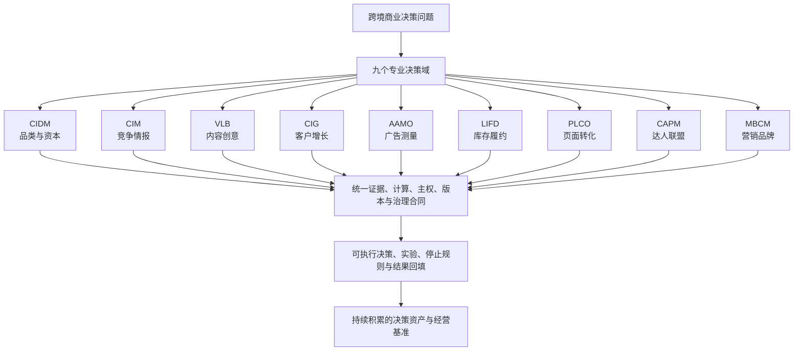
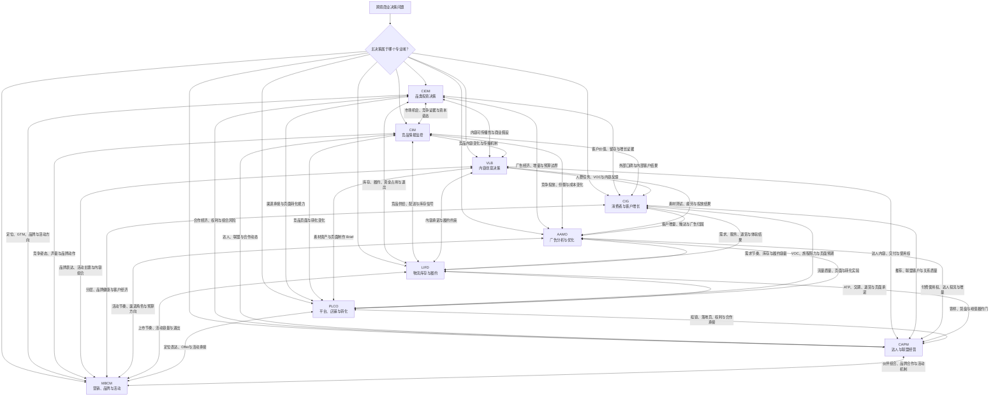

# CrossBorder Decision Lab

[English](README.en.md) · [九个专业 Skill](#skill-快速定位) · [系统结构](#系统结构) · [使用方式](#如何使用) · [维护规则](RULES.md)

> 面向跨境商业的专业决策基础设施，把依赖个人经验的经营判断转化为有证据、有模型、有边界、有动作、有停止规则、可持续积累的决策资产。

CrossBorder Decision Lab 服务于跨境电商经营者、品牌团队、投资决策者与专业服务团队。它不是一组通用提示词，也不是把九类业务知识简单放进同一个目录，而是把品类投资、竞争情报、内容、客户、广告、履约、页面、达人合作与营销品牌连接成一套可以独立运行、跨域协同和持续进化的专业决策系统。

系统当前已完成九个专业决策域的核心功能建设，覆盖专业工作流、数学模型、证据与反证、连续追问、单 Skill 执行、跨 Skill 联动、异常与压力场景、停止与退出机制，以及统一的质量治理。

## 系统价值与长期壁垒

大模型会持续变强，单次生成内容的成本也会持续下降。真正具有长期价值的不是某一个模型，而是建立在模型之上的专业决策基础设施。

CrossBorder Decision Lab 将跨境经营中分散、隐性的个人经验，转化为可以复用和持续积累的系统能力：

- 把模糊问题拆成明确的决策对象、约束、证据、反事实和责任边界；
- 把“感觉可行”转化为可复算的经济模型、实验方案和行动门槛；
- 把单点分析连接成品类、竞争、内容、客户、广告、供应链、页面、渠道与品牌的协同决策；
- 把成功、失败、异常、停止和退出都纳入同一套经营闭环；
- 把每次使用沉淀为可追溯的判断、动作、结果、修正和业务基准。

系统价值与长期壁垒是同一件事：系统解决的问题越重要，进入真实经营流程越深，积累的决策资产越多，后续决策就越准确、越高效，也越难被简单复制。

```text
专业决策框架与数学模型
            ↓
进入真实跨境经营工作流
            ↓
沉淀“问题—证据—判断—动作—结果”
            ↓
形成国家、平台、品类与生命周期业务基准
            ↓
持续校准模型、门槛、反例与决策路径
            ↓
提升决策质量、协作效率与经营确定性
            ↓
形成数据资产、工作流、专业治理与组织信任壁垒
```

### 为什么它不容易被更强的通用模型替代

通用模型可以理解材料、生成方案和辅助推理，但不会天然拥有一套企业长期积累的：

1. 决策对象和专业主权边界；
2. 历史判断、版本变化与责任链；
3. 国家、平台、品类、价格带和生命周期基准；
4. 成功、失败、异常、停止和退出案例；
5. 业务动作与后续经营结果之间的连续反馈；
6. 跨团队共同使用的证据、计算和审批语言。

模型是可以升级和替换的推理引擎；CrossBorder Decision Lab 保留的是模型之上的专业方法、经营上下文、计算工具、协作协议和持续复利的决策资产。

### 面向长期使用的复利机制

每一次实际使用都会增加系统的长期价值：

- 新问题扩展专业场景覆盖；
- 新证据丰富国家、平台和品类基准；
- 新动作补充经营策略与执行边界；
- 新结果修正参数、门槛和反事实；
- 新失败转化为反例、压力测试和阻断条件；
- 新协作沉淀为可追溯、可复用的组织工作流。

这使系统从“能够回答专业问题”，逐步发展为“能够持续管理专业决策”。

## 系统结构

### 三层价值结构



第一层解决“应该由哪个专业域判断”；第二层保证不同专业结论可以在统一合同下协作；第三层把判断转化为动作、结果和可持续积累的经营资产。

### 九 Skill 双向协同结构



双向连线代表专业证据、约束和建议可以互相承接，不代表任何 Skill 可以覆盖另一个 Skill 的最终主权。每次跨域协作都保留来源、版本、结论、置信度、允许用途和停止条件。

## Skill 快速定位

按“需要做什么决策”选择主 Skill。每个 Skill 的平台覆盖、专业模型、执行流程、输入输出和失败边界，请进入对应目录查看。

| Skill | Runtime | 主要解决的问题 | 专业入口 |
|---|---|---|---|
| **CIDM** | `CIDM-2026.14` | 什么值得进入、投资、测试、放量、收缩或退出？ | [品类投资决策](category-investment-decision/SKILL.md) |
| **CIM** | `CIM-2026.10` | 竞品是谁、发生了什么变化、为什么重要、如何响应？ | [竞品情报监控](competitive-intelligence-monitoring/SKILL.md) |
| **VLB** | `VLB-2026.10` | 内容为什么有效、能否迁移、如何生产、测试和规模化？ | [内容创意与传播](video-link-breakdown/SKILL.md) |
| **CIG** | `CIG-2026.09` | 客户是谁、需求和阻力是什么、什么是真增量、如何增长？ | [消费者洞察与客户增长](consumer-insights-customer-growth/SKILL.md) |
| **AAMO** | `AAMO-2026.08` | 广告能否投、问题在哪里、真实增量多少、如何配置和停止？ | [广告分析、测量与优化](advertising-analysis-measurement-optimization/SKILL.md) |
| **LIFD** | `LIFD-2026.04` | 走什么路线和仓、何时补货、库存怎么分、如何履约和退出？ | [物流、库存与履约](logistics-inventory-fulfillment-decision/SKILL.md) |
| **PLCO** | `PLCO-2026.08` | 店铺和页面能否承接，标题、主图、详情或落地页具体怎么改？ | [平台、店铺与转化](platform-store-listing-conversion/SKILL.md) |
| **CAPM** | `CAPM-2026.07` | 找谁合作、如何报价、寄样、签约、购买权利、经营联盟和退出？ | [达人与联盟经营](creator-affiliate-partnership-management/SKILL.md) |
| **MBCM** | `MBCM-2026.01` | 如何分层、定位、上市、建设品牌、组织活动和编排营销资源？ | [营销、品牌与活动](marketing-brand-campaign-management/SKILL.md) |

## 统一决策基础设施

九个专业域共享一套底层决策原则：

1. **证据与反证**：观察、用户输入、授权数据、外部基准、推断和假设分开记录。
2. **数学与守恒**：利润、增量、容量、组合和风险通过可复算模型计算。
3. **专业主权**：资本、广告、客户、页面、履约、内容、伙伴和品牌结论不互相越权。
4. **版本与血缘**：对象、证据、计算、结论和动作均保留版本与来源。
5. **连续追问**：新信息只重算受影响部分，不静默覆盖历史判断。
6. **动作闭环**：每个结论绑定责任人、资源、观察窗、成功条件、停止和回滚。
7. **失败治理**：缺失、冲突、污染、异常、事故、收缩和退出均有明确处理路径。
8. **长期校准**：随着持续使用，逐步形成适配国家、平台、品类和生命周期的经营基准。

## 当前能力

当前版本已经形成九个可独立运行、可跨域联动的专业决策 Skill，并完成：

- 专业场景与生命周期覆盖；
- 确定性经济模型与统计估计工具；
- 单 Skill、跨 Skill 和连续追问执行；
- 极端组合、冲突、缺失、失败和压力测试；
- 证据、计算、结论、动作和版本血缘；
- 专业主权、风险红线、停止、回滚与退出治理；
- 仓库级自动化校验和发布门禁。

系统不依赖固定的大模型供应商。模型可以持续升级，专业决策合同、计算工具、业务基准和历史资产保持连续。

## 如何使用

### 1. 直接描述决策问题

例如：

- “这个品类是否值得进入美国 Amazon？”
- “竞品最近为什么突然增长？”
- “这条视频为什么有效，适不适合我的产品？”
- “这批客户为什么没有复购？”
- “广告有订单但没有利润，应该怎么处理？”
- “现在应该补多少库存、走哪个仓？”
- “这个 Listing 的主图和详情页具体怎么改？”
- “这个达人值不值得寄样和签约？”
- “新品应该如何定位、上市和组织营销活动？”

### 2. 由主 Skill 完成专业判断

主 Skill 固定对象、证据、约束和决策目标，调用相应模型并输出行动、成功条件、停止规则和需要承接的其他专业域。

### 3. 按需进行跨 Skill 联动

复杂问题可以由多个 Skill 交换经过版本化的证据和约束，但最终结论仍由拥有该决策主权的 Skill 给出。

### 4. 持续回填与校准

实际动作和经营结果回填后，系统更新业务基准、参数、反例和下一阶段决策。

## 仓库导航

| 位置 | 内容 |
|---|---|
| 九个专业 Skill 目录 | 各专业域的入口、工作流、模型、参考资料和测试 |
| [`evaluations/`](evaluations/) | 单 Skill、跨 Skill、连续追问、对抗与极端场景 |
| [`governance/`](governance/) | 主权、成熟度、变更影响与共享治理合同 |
| [`scripts/`](scripts/) | 全仓校验、质量评分、集成与发布门禁 |
| [`.github/workflows/expert-release.yml`](.github/workflows/expert-release.yml) | 自动化发布质量门 |
| [`requirements-dev.txt`](requirements-dev.txt) | 本地与自动化校验使用的锁定依赖 |
| [`RULES.md`](RULES.md) | 仓库维护、版本、测试和发布规则 |

## 质量与安全边界

- 动态平台规则、法规、价格和市场事实在执行时按日期核验。
- 平台归因、相关性、预测和因果增量保持严格区分。
- 财务结论区分事实、用户输入、外部基准和情景假设。
- 法律、税务、知识产权和监管事项保留适格专业主权。
- 系统不支持虚假互动、欺骗性宣传、侵权、刷评或规避平台规则。
- 内容迁移聚焦可转移机制和测试逻辑，不复制受保护表达。

## Copyright

Copyright © 2026 Miles Chen. All rights reserved.

CrossBorder Decision Lab / 出海决策实验室及其原创决策框架、评分模型、工作流、文档和代码受版权保护。未经版权所有者事先书面许可，不得复制、修改、分发、转授权、销售、商业使用或基于本仓库内容制作衍生作品。详见 [LICENSE](LICENSE)。
